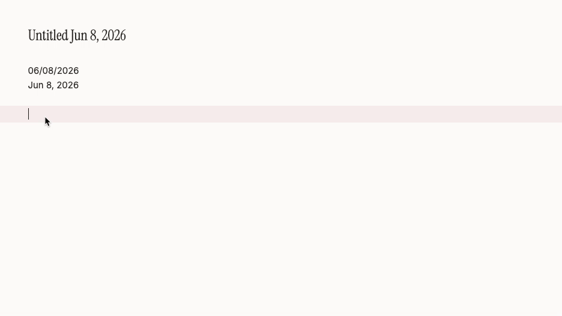

# Quick Date Picker

[English](README.md) | [中文](README.zh.md)

Quickly insert dates in Obsidian by typing `@` (or your custom trigger character) to summon a mini calendar, pick a date, and insert with one click.

## Features

- **Mini Calendar Popup**: A calendar pops up in real-time after typing the trigger character. Supports both mouse selection and keyboard navigation.
- **Relative Date Shortcuts**: Supports quick syntax like `@+3d`, `-1w`, `2m` without opening the calendar.
- **Multiple Output Formats**: Built-in formats (Standard, Wiki Link, Chinese, Compact, etc.) with customizable prefix/suffix.
- **Weekday Output**: Optionally append the day of week after the date — Chinese (`星期四`), Chinese short (`周四`), English (`Thursday`), or English short (`Thu`).
- **Custom Date–Weekday Layout**: Arrange date and weekday freely with placeholders, e.g. `日期 星期`, `日期（星期）`, or `{date} ({weekday})`.
- **Instant Format Switching**: Frequently-used format buttons appear in the mini calendar popup, allowing quick format switching without opening Settings.
- **Title Bar Support**: Use the date picker in note titles (file names) as well.
- **Multi-language UI**: Settings and calendar follow Obsidian’s interface language (Chinese locales → Simplified Chinese UI; others → English). Weekday-related defaults also switch with the language.

## Demo

### Calendar Popup


### Relative Date Shortcuts



### Settings Panel


## Installation

### From Obsidian Community Plugin Marketplace (Recommended)

1. Open Obsidian, go to **Settings → Community Plugins**
2. Turn off Safe Mode if it is still on
3. Click **Browse**, search for "Quick Date Picker"
4. Click Install, then Enable

### Manual Installation

1. Download the latest `main.js`, `manifest.json`, and `styles.css` from [Releases](https://github.com/ritalee2333/obsidian-quick-date-picker/releases)
2. Place the files into your vault's `.obsidian/plugins/quick-date-picker/` directory
3. Restart Obsidian and enable the plugin in Settings

## Usage

### In Document Body

1. Type `@` (or your configured trigger character) in the editor
2. The mini calendar pops up. Choose a date via:
   - **Mouse**: Click a date cell, then click Confirm or a format button
   - **Keyboard**: Arrow keys to move, Enter to confirm, Escape to close
   - **Relative date**: Type `+3d`, `-1w`, `2m`, `-1y`, etc. to auto-convert to the corresponding date
3. The formatted date text is inserted at the cursor position

### In Note Title

1. Click the note title to enter edit mode
2. Type the trigger character to summon the calendar
3. Select a date to auto-replace the trigger text

### Relative Date Syntax

| Input | Meaning |
|-------|---------|
| `+3d` | 3 days later |
| `-1w` | 1 week ago |
| `2m`  | 2 months later |
| `-1y` | 1 year ago |

Unit reference: `d`=day, `w`=week, `m`=month, `y`=year. `+` can be omitted.

## Settings

Go to **Settings → Community Plugins → Quick Date Picker** to configure:

- **Trigger Character**: Customize the character that summons the calendar (default `@`)
- **Remember Last Format**: When enabled, the popup auto-selects the format you last used
- **Include Weekday**: When enabled, append weekday text after the formatted date
- **Weekday Format**: Choose Chinese / Chinese short / English / English short
- **Date & Weekday Arrangement**: Control how date and weekday are combined (see below)
- **Default Format**: Set the default date output format (with live red preview)
- **Favorite Formats**: Add, remove, and reorder frequently-used format templates (each with its own preview)

### Format Template Syntax

Supported date tokens:

| Token | Description | Example |
|-------|-------------|---------|
| `YYYY` | Four-digit year | 2026 |
| `YY`   | Two-digit year | 26 |
| `MMMM` | Full month name (English) | June |
| `MMM`  | Short month name (English) | Jun |
| `MM`   | Two-digit month | 05 |
| `M`    | One-digit month | 5 |
| `DD`   | Two-digit day | 23 |
| `D`    | One-digit day | 23 |

Prefix/Suffix example: `prefix [[` + `YYYY-MM-DD` + `suffix ]]` = `[[2026-05-23]]`

### Weekday Arrangement

When **Include Weekday** is on, use these placeholders in the arrangement field:

| Pattern | Example output |
|---------|----------------|
| `日期 星期` or `{date} {weekday}` | `2026-09-24 周四` |
| `日期-星期` or `{date}-{weekday}` | `2026-09-24-周四` |
| `日期（星期）` or `{date}（{weekday}）` | `2026-09-24（周四）` |
| `{date} ({weekday})` | `2026-09-24 (Thu)` |

`日期` / `{date}` = formatted date; `星期` / `{weekday}` = weekday text in the format you selected.

## Compatibility

- Obsidian Desktop: supported
- Obsidian Mobile: supported
- Minimum Obsidian version: v0.15.0

## Development

```bash
# Install dependencies
npm install

# Development mode (watch for changes)
npm run dev

# Build production bundle
npm run build

# Run tests
npm test
```

## Support

If you encounter any issues or have feature suggestions, please open an issue on [GitHub Issues](https://github.com/ritalee2333/obsidian-quick-date-picker/issues).

## License

[MIT](LICENSE)
